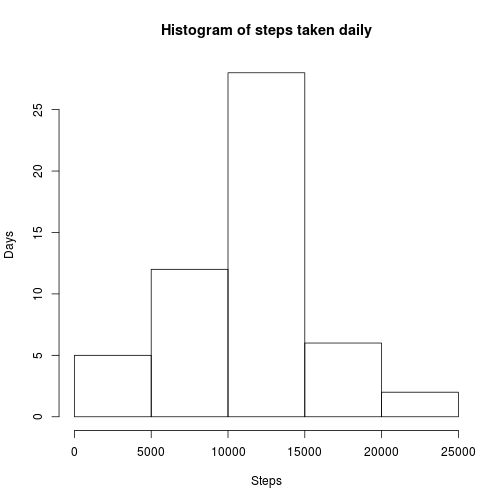
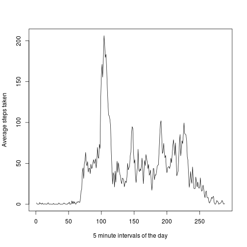
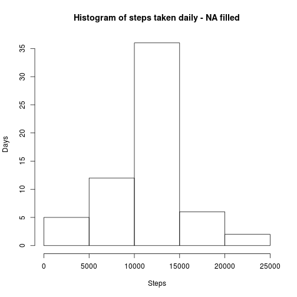
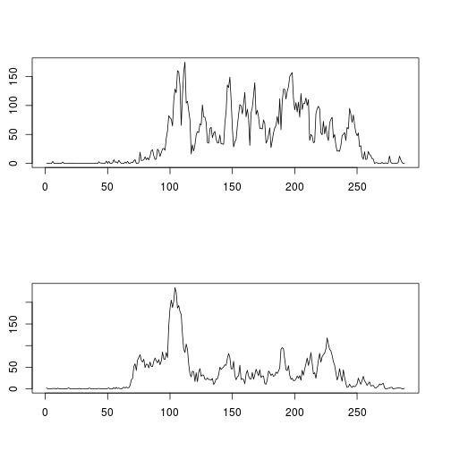

# Homework Assignment I. for Reproducible Research
## Initial steps

As a basic setup, the data sources are as follows:


```r
library(knitr)
opts_chunk$set(echo = TRUE)
workdir <-"~/course-work/C5/"
url <- "https://d396qusza40orc.cloudfront.net/repdata%2Fdata%2Factivity.zip"
filename <- "activity.zip"
```

Our first task for the assigment is to download the datafile from the given [URL](https://d396qusza40orc.cloudfront.net/repdata%2Fdata%2Factivity.zip), and decompress it and check the summary.

Our working directory will be: *~/course-work/C5/*


```r
download.file(url, paste(workdir,filename), method='curl')
```

```
## Warning in download.file(url, paste(workdir, filename), method = "curl"):
## download had nonzero exit status
```

```r
data <- read.table(unzip(paste(workdir,filename),"activity.csv"), header=TRUE, sep=",")
summary(data)
```

```
##      steps                date          interval     
##  Min.   :  0.00   2012-10-01:  288   Min.   :   0.0  
##  1st Qu.:  0.00   2012-10-02:  288   1st Qu.: 588.8  
##  Median :  0.00   2012-10-03:  288   Median :1177.5  
##  Mean   : 37.38   2012-10-04:  288   Mean   :1177.5  
##  3rd Qu.: 12.00   2012-10-05:  288   3rd Qu.:1766.2  
##  Max.   :806.00   2012-10-06:  288   Max.   :2355.0  
##  NA's   :2304     (Other)   :15840
```

First we should check the head of the data table to see how the data in it looks like.


```r
head(data)
```

```
##   steps       date interval
## 1    NA 2012-10-01        0
## 2    NA 2012-10-01        5
## 3    NA 2012-10-01       10
## 4    NA 2012-10-01       15
## 5    NA 2012-10-01       20
## 6    NA 2012-10-01       25
```

We see, that **NA** is present in many cases for the *steps* variable. We will be forced to use na.rm = TRUE later on.

We have to merge the interval data, so as to get to the daily sums of steps.


```r
aggregated_steps <-aggregate(. ~ date,  data=data, FUN=sum, na.rm=TRUE)
head(aggregated_steps)
```

```
##         date steps interval
## 1 2012-10-02   126   339120
## 2 2012-10-03 11352   339120
## 3 2012-10-04 12116   339120
## 4 2012-10-05 13294   339120
## 5 2012-10-06 15420   339120
## 6 2012-10-07 11015   339120
```

## First part of assignment question

**What is the mean and median of our data?**

In order to answer this, we prepare the histogram of total steps per day and calculate mean, median values.


```r
hist(aggregated_steps$steps, main="Histogram of steps taken daily", xlab="Steps", ylab="Days")
```

 

```r
mea <- mean(aggregated_steps$steps)
med <- median(aggregated_steps$steps)
options(scipen=999) # disable scientific notation by output.
```

We can conclude, that the **mean** number of steps is $$10766.1886792$$ and the **median** is $$10765$$.

## Second part of assignment question
**What is the daily activity pattern?

To be able to visualize this, a time series has be created and data has to be averaged out for intervals.
First, let us check, how the notation is for intervals?


```r
print(data$interval[seq(50)])
```

```
##  [1]   0   5  10  15  20  25  30  35  40  45  50  55 100 105 110 115 120
## [18] 125 130 135 140 145 150 155 200 205 210 215 220 225 230 235 240 245
## [35] 250 255 300 305 310 315 320 325 330 335 340 345 350 355 400 405
```

Luckily, the intervals have unique *id*s, so we can simply average over them.
Let's see!


```r
# and the data aggregation
aggregated_intervals <-aggregate(. ~ interval,  data=data, FUN=mean, na.rm=TRUE)

head(aggregated_intervals)
```

```
##   interval     steps     date
## 1        0 1.7169811 30.71698
## 2        5 0.3396226 30.71698
## 3       10 0.1320755 30.71698
## 4       15 0.1509434 30.71698
## 5       20 0.0754717 30.71698
## 6       25 2.0943396 30.71698
```

**COOL!** 
By now, we have the data.
Let's take a look, we might get a pattern!


```r
plot(aggregated_intervals$steps,  type="l", xlab="5 minute intervals of the day", ylab="Average steps taken")
```

 

```r
ma <- which(aggregated_intervals$steps==max(aggregated_intervals$steps),arr.ind=TRUE)
maxtime<-sprintf("%04d",aggregated_intervals$interval[ma])
maxtime<-format(strptime(maxtime, format="%H%M"), format = "%H:%M")
```

### Conclusion
The time with the maximal average steps taken daily is **08:35**.

## Third part of Assignment question

Let us first calculate the number of missing values in the original data!


```r
missing_data<-sum(is.na(data$steps))
```

The number of missing datapoints: $2304$

Let us fill the places with the mean for the day!


```r
filled_data <- data
na_mask<-is.na(filled_data$steps)
intervals_vec <-aggregated_intervals$steps
filled_data$steps <- with(filled_data, ifelse(is.na(steps), intervals_vec , steps))
```

Now let us again look at te data from the mean, median and histogram ppoint of view!


```r
aggregated_steps_filled <-aggregate(. ~ date,  data=filled_data, FUN=sum, na.rm=TRUE)
hist(aggregated_steps_filled$steps, main="Histogram of steps taken daily - NA filled", xlab="Steps", ylab="Days")
```

 

```r
mea2 <- mean(aggregated_steps_filled$steps)
med2 <- median(aggregated_steps_filled$steps)
options(scipen=999) # disable scientific notation by output.
```

We can conclude, that the **mean** number of steps is $$10766.1886792$$ and the **median** is $$10766.1886792$$.
Which is compared to the **original mean** of  $$10766.1886792$$ and **original median** $$10765$$ a **small** difference, and only in the *median*.

## Fourth part of assignment question

We would like to separate weekdays and weekends, and then run some plotting.

Let us first add a weekday column to the data!


```r
data$weekday <- weekdays(as.Date(data$date))
```

After this, we can do a filtering into two parts, and then start the plotting.


```r
weekend = list("szombat","vasárnap")
weekend_data <- subset(data, weekday %in% weekend)
weekend_data$weekday <-NULL
weekday_data <- subset(data, !(weekday %in% weekend))
weekday_data$weekday <-NULL
#head(weekend_data)
aggregated_weekday_intervals <-aggregate(. ~ interval,  data=weekday_data, FUN=mean, na.rm=TRUE)
aggregated_weekend_intervals <-aggregate(. ~ interval,  data=weekend_data, FUN=mean, na.rm=TRUE)
#head(aggregated_weekend_intervals)

par(mfrow=c(2,1), pin=c(6,1.7))
plot(aggregated_weekend_intervals$steps,  type="l", xlab ="", ylab="")

plot(aggregated_weekday_intervals$steps,  type="l", xlab="", ylab="")
```

 


###Conclusion

We can conclude, that the activity patterns on weekdays and weekendy are different.
